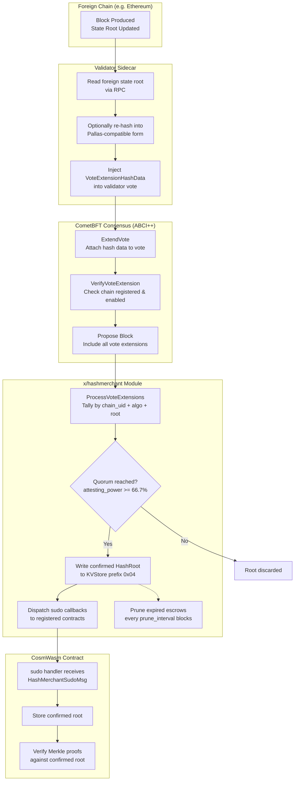

<!--
order: 3
-->

# State Transitions

## Overview

The following diagram shows the complete lifecycle of a hash root — from foreign-chain data to smart contract consumption:



## Chain Registration

**Trigger**: `MsgRegisterChain` (governance-only)

1. Verify `msg.Authority` matches the governance module address
2. Check that `chain_uid` does not already exist in the registry
3. Store the `RegisteredChain` at `0x01 | chain_uid`
4. Emit `hashmerchant_register_chain` event

After registration, validators running the sidecar for this chain will begin including its state root in their vote extensions.

## Contract Registration

**Trigger**: `MsgRegisterContract`

1. Verify the target `chain_uid` exists and is enabled
2. Validate the escrow coin:
   - Denom must match `params.escrow_denom`
   - Amount must be >= `params.min_escrow_amount`
3. Transfer escrow from sender to the `hashmerchant` module account
4. Compute `paid_until_height`:
   ```
   periods = escrow_amount / min_escrow_amount
   paid_until_height = current_block_height + (periods * prune_interval)
   ```
5. Store `RegisteredContract` at `0x02 | contract_addr`
6. Store `EscrowRecord` at `0x03 | contract_addr`
7. Emit `hashmerchant_register_contract` event

The contract immediately begins receiving sudo callbacks for confirmed roots on the registered chain.

## Escrow Refill

**Trigger**: `MsgRefillEscrow`

1. Look up existing `EscrowRecord` for the contract
2. Validate denom matches `params.escrow_denom`
3. Transfer additional escrow to module account
4. Extend `paid_until_height`:
   ```
   additional_periods = refill_amount / min_escrow_amount
   paid_until_height += additional_periods * prune_interval
   ```
5. Update `EscrowRecord` with new total amount and extended height

If the contract was previously disabled due to escrow expiry, the deployer must re-register (a refill only extends an active registration).

## Hash Root Confirmation

**Trigger**: `ProcessVoteExtensions` (called during block processing)

This is the core state transition that converts validator attestations into confirmed on-chain data:

1. **Collect**: Iterate all vote extensions from the previous round's commit
2. **Decode**: Unmarshal each non-empty extension as `VoteExtensionHashData`
3. **Tally**: Group by `(chain_uid, algo)`, then by `root` value. Track voting power per root.
4. **Quorum check**: For each `(chain_uid, algo)` pair, check if any root's attesting power meets the threshold:
   ```
   threshold = quorum_fraction * total_bonded_power
   ```
5. **Write**: If quorum is reached, store the `HashRoot` at `0x04 | chain_uid | "|" | algo`
6. **Dispatch**: Call `dispatchSudoCallbacks` for each confirmed root (see below)
7. **Emit**: `hashmerchant_root_confirmed` event with chain_uid, algo, and attestation count

If multiple different roots are reported for the same `(chain_uid, algo)` and none reaches quorum, no root is written for that pair in this block.

## Sudo Dispatch

**Trigger**: Called internally after a HashRoot is confirmed

1. Iterate all `RegisteredContract` entries
2. For each contract where `chain_uid` matches and `enabled == true`:
   - Check that `EscrowRecord.paid_until_height >= current_block_height`
   - Marshal `HashMerchantSudoMsg` as JSON
   - Call `wasmKeeper.Sudo(ctx, contractAddr, msg)`
   - Log errors but continue to next contract (one contract's failure does not block others)

## Escrow Pruning

**Trigger**: `EndBlocker`, every `prune_interval` blocks

1. Check if `current_block_height - last_prune_epoch >= prune_interval`
2. If so, iterate all `EscrowRecord` entries
3. For each record where `paid_until_height < current_block_height`:
   - Set the associated `RegisteredContract.enabled = false`
   - Log the disablement
4. Update `prune_epoch` to `current_block_height`

Pruning is not retroactive — a contract's escrow may technically expire mid-interval but will only be disabled at the next prune boundary.
