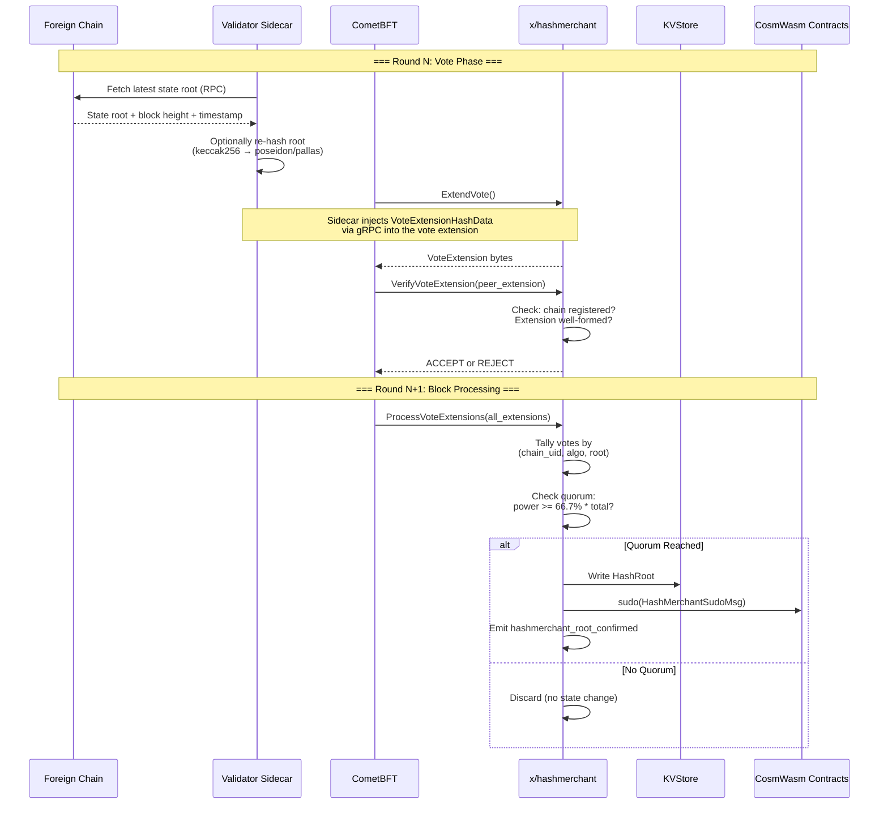

<!--
order: 5
-->

# Vote Extensions

The hashmerchant module uses **ABCI++ vote extensions** to embed foreign-chain state attestations directly into the CometBFT consensus process. This section describes the full lifecycle of a vote extension from sidecar injection to on-chain root confirmation.

## Architecture



## VoteExtensionHashData

This is the protobuf payload that validators embed in their vote extensions:

```protobuf
message VoteExtensionHashData {
  string runtime_id         = 1;  // sidecar runtime identifier
  string chain_uid          = 2;  // which chain this root belongs to
  string algo               = 3;  // hash algorithm (e.g. "keccak256")
  bytes  root               = 4;  // the state root (typically 32 bytes)
  uint64 foreign_height     = 5;  // block height on the foreign chain
  int64  foreign_block_time = 6;  // block timestamp (unix seconds)
  bytes  ics23_proof        = 7;  // optional ICS-23 commitment proof
}
```

The sidecar fills in all fields. The `ics23_proof` field is optional and can carry an ICS-23 existence proof for additional verification.

## ExtendVote Handler

Called by CometBFT when the local validator is preparing its vote.

**Current behavior**: Returns an empty vote extension. The actual hash data is injected by the validator's **sidecar process** (hash-market-server) which communicates with the application layer via gRPC.

Validators who do not run the sidecar will submit empty extensions. This is by design — participation is optional, and the quorum mechanism handles partial participation.

## VerifyVoteExtension Handler

Called when the validator receives a peer's vote and needs to decide whether to accept or reject the attached extension.

**Logic:**

1. **Empty extension** → `ACCEPT` (the peer may not be running the sidecar)
2. **Unmarshal fails** → `REJECT` (malformed data)
3. **Chain not registered** → `REJECT` (attestation for unknown chain)
4. **Otherwise** → `ACCEPT`

This lightweight verification ensures only structurally valid attestations for known chains enter the tally. The quorum mechanism provides the actual security guarantee.

## ProcessVoteExtensions

Called during block processing to aggregate vote extensions from the previous consensus round and write confirmed roots.

**Algorithm:**

```
1. Initialize tally: map[(chain_uid, algo)] → map[root_hex] → []rootVote
2. Initialize total_power = 0

3. For each vote in extended_commit:
     total_power += vote.validator.power
     if vote.extension is empty: skip
     decode VoteExtensionHashData
     if decode fails: skip
     append rootVote{root, height, block_time, power} to tally[(chain_uid, algo)][root_hex]

4. quorum_threshold = quorum_fraction * total_power

5. For each (chain_uid, algo) in tally:
     For each root_hex with votes:
       attesting_power = sum(votes.power)
       if attesting_power >= quorum_threshold:
         write HashRoot to store
         dispatch sudo callbacks
         emit event
```

**Key properties:**

- **Weighted by voting power**: A validator with 10% of stake counts 10x more than one with 1%
- **Per-(chain, algo) quorum**: Each chain/algorithm pair is tallied independently
- **Winner-takes-all**: If multiple roots are reported, only the one reaching quorum is written (if any)
- **Byzantine tolerant**: With a 66.7% quorum threshold, a confirmed root cannot be forged unless 1/3+ of voting power is malicious

## Sidecar Architecture

The validator sidecar is an out-of-process service that:

1. Maintains RPC connections to registered foreign chains
2. Polls for the latest finalized block and its state root
3. Optionally computes Pallas-curve re-hashes (e.g., Poseidon hash of the keccak256 root)
4. Serves the `VoteExtensionHashData` payload via gRPC when queried by the application during `ExtendVote`

The sidecar is intentionally separate from the validator process to:

- Avoid adding latency to consensus
- Allow independent upgrades of the foreign-chain reading logic
- Support multiple foreign chains without bloating the node binary
- Isolate failures (a sidecar crash results in empty extensions, not a node crash)
