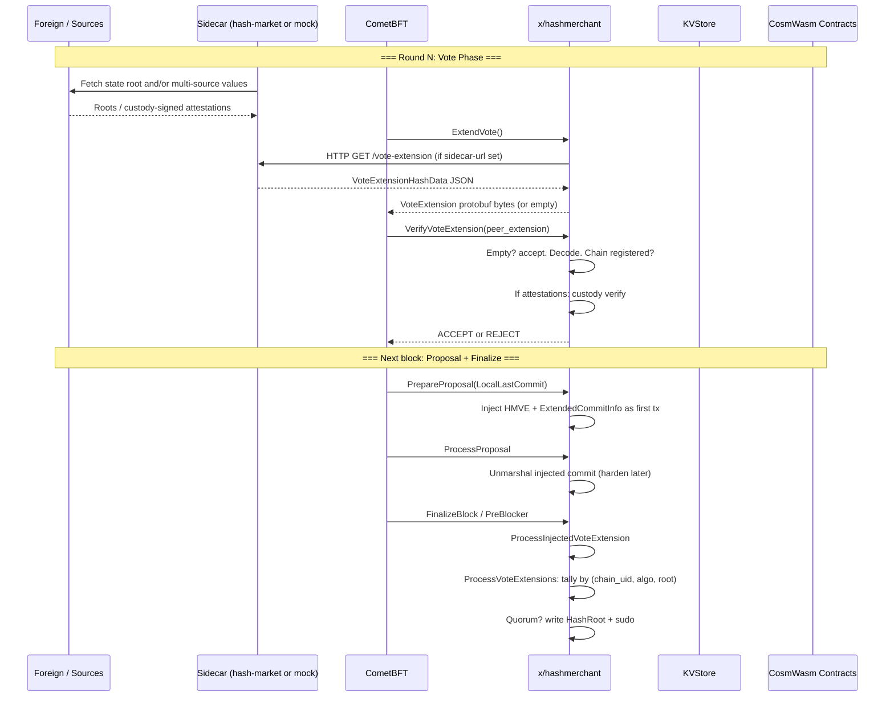

<!--
order: 5
-->

# Vote Extensions

The hashmerchant module uses **ABCI++ vote extensions** to embed foreign-chain (and optional multi-source oracle) attestations into CometBFT consensus. This section describes the lifecycle from sidecar injection to on-chain root confirmation.

For multi-source aggregation rules, root models, and implementation gaps, see **[10_multi_source_oracle.md](10_multi_source_oracle.md)**.

## Architecture


```mermaid
sequenceDiagram
    participant FC as Foreign / Sources
    participant SC as Sidecar (hash-market or mock)
    participant CMT as CometBFT
    participant APP as x/hashmerchant
    participant KV as KVStore
    participant CW as CosmWasm Contracts

    Note over FC,CW: === Round N: Vote Phase ===

    SC->>FC: Fetch state root and/or multi-source values
    FC-->>SC: Roots / custody-signed attestations

    CMT->>APP: ExtendVote()
    APP->>SC: HTTP GET /vote-extension (if sidecar-url set)
    SC-->>APP: VoteExtensionHashData JSON
    APP-->>CMT: VoteExtension protobuf bytes (or empty)

    CMT->>APP: VerifyVoteExtension(peer_extension)
    APP->>APP: Empty? accept. Decode. Chain registered?
    APP->>APP: If attestations: custody verify
    APP-->>CMT: ACCEPT or REJECT

    Note over FC,CW: === Next block: Proposal + Finalize ===

    CMT->>APP: PrepareProposal(LocalLastCommit)
    APP->>APP: Inject HMVE + ExtendedCommitInfo as first tx
    CMT->>APP: ProcessProposal
    APP->>APP: Unmarshal injected commit (harden later)

    CMT->>APP: FinalizeBlock / PreBlocker
    APP->>APP: ProcessInjectedVoteExtension
    APP->>APP: ProcessVoteExtensions: tally by (chain_uid, algo, root)
    APP->>APP: Quorum? write HashRoot + sudo
```

## VoteExtensionHashData

```protobuf
message VoteExtensionHashData {
  string runtime_id         = 1;  // sidecar runtime identifier
  string chain_uid          = 2;
  string algo               = 3;  // e.g. keccak256 | oracle-agg-v1
  bytes  root               = 4;
  uint64 foreign_height     = 5;
  int64  foreign_block_time = 6;
  bytes  ics23_proof        = 7;  // optional ICS-23 or legacy HMOR bundle
  repeated OracleAttestation attestations = 8;  // multi-source (optional)
}
```

Legacy sidecars may omit `attestations` (Model A single root). See [10_multi_source_oracle.md](10_multi_source_oracle.md) for Model A vs B.

## ExtendVote Handler

Called when the local validator prepares its vote.

**Behavior:**

1. If `hashmerchant.sidecar-url` / `HASHMERCHANT_SIDECAR_URL` is empty → **empty** extension (backwards compatible).
2. Else HTTP GET `{sidecar-url}/vote-extension` with configured timeout.
3. On any error → **empty** extension (log warning; do not halt consensus).
4. On success → marshal `VoteExtensionHashData` (including attestations; if root empty and attestations present, current code fills root via incomplete aggregate — see multi-source spec §4.3).

Validators who do not run a sidecar submit empty extensions. Quorum handles partial participation.

## VerifyVoteExtension Handler

1. **Empty extension** → `ACCEPT`
2. **Unmarshal fails** → `REJECT`
3. **Chain not registered or disabled** → `REJECT`
4. **Attestations non-empty** → each must pass custody verification against registered `OracleSource` for that `chain_uid` (ed25519 today)
5. **Otherwise** → `ACCEPT`

**Target (not fully implemented):** Model B root↔aggregate binding; algo allowlist; MarketMode; duplicate source rejection. Spec: [10_multi_source_oracle.md](10_multi_source_oracle.md).

Quorum on root remains the primary security property for Model A.

## PrepareProposal / ProcessProposal

| Handler | Behavior |
|---------|----------|
| **PrepareProposal** | If any non-empty VE in `LocalLastCommit`, prepend `HMVE` (4-byte magic `0x48 0x4D 0x56 0x45`) + marshalled `ExtendedCommitInfo` as first “tx”. |
| **ProcessProposal** | If first tx has `HMVE` prefix, require successful unmarshal of `ExtendedCommitInfo`. (Does not yet fully re-validate against vote set.) |
| **PreBlocker** | `ProcessInjectedVoteExtension(txs)` → `ProcessVoteExtensions` |

## ProcessVoteExtensions

**Algorithm (current):**

```
1. tally: map[(chain_uid, algo)] → map[root_hex] → []rootVote
2. total_power = sum of all votes' power in ExtendedCommitInfo

3. For each vote:
     total_power already counted
     if empty extension: skip
     decode VoteExtensionHashData (skip on failure)
     append {root, height, block_time, power, attestations} under root_hex

4. quorum_threshold = quorum_fraction * total_power

5. For each (chain_uid, algo) and each root_hex:
     if sum(power) >= threshold:
       write HashRoot (attestations currently from first vote only — see multi-source §5.1)
       dispatch sudo
       emit hashmerchant_root_confirmed
```

**Properties:**

- Weighted by voting power
- Per `(chain_uid, algo)` independent
- Empty extensions do not contribute a root but count toward total power (stricter quorum)
- Byzantine tolerance follows CometBFT + quorum_fraction (default ~⅔)

## Sidecar architecture

The sidecar is an **out-of-process** service (in-house: `crates/terp-rs/tools/hash-market`, lab mock: `tests/tsh/hashmerchant/mock-sidecar.py`):

1. Ingest foreign roots and/or multi-source feeds (HTTP, RPC, postgres, etc.)
2. Optionally custody-sign per-source values
3. Serve `GET /health` and `GET /vote-extension`
4. Isolate failures: crash → empty VE, not validator halt

Config on node: `app.toml` `[hashmerchant] sidecar-url` or env `HASHMERCHANT_SIDECAR_URL`.

HTTP shapes: `tools/hashmerchant-support/sidecar-api.md`.

## EndBlocker

Prunes expired contract escrows on interval. Root processing is **not** in EndBlocker; it runs in PreBlocker via injected VE tx.
