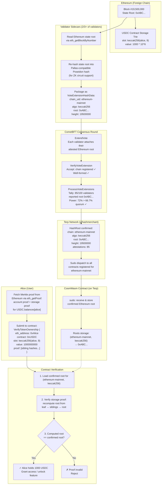
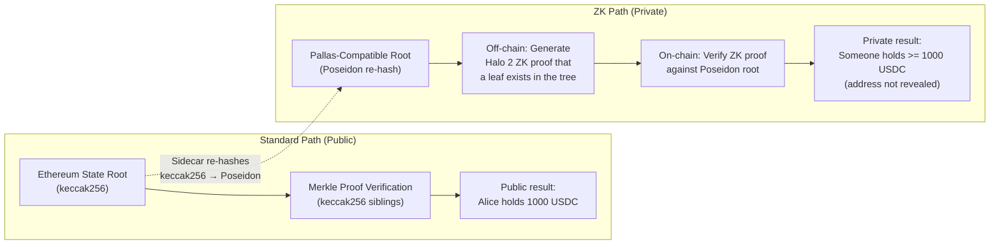

<!--
order: 9
-->

# Example: Proving ERC-20 Token Ownership

This walkthrough demonstrates how the hashmerchant module enables a CosmWasm contract on Terp to verify that a user holds tokens on Ethereum — without any direct connection to Ethereum.

## The Problem

Alice holds 1,000 USDC on Ethereum. She wants to prove this on Terp Network so she can access a gated feature in a CosmWasm contract (e.g., a DAO that requires USDC holdings to vote, or a DeFi protocol that accepts cross-chain collateral).

Without hashmerchant, this would require either:

- A full Ethereum light client on Terp (expensive, complex)
- A trusted bridge or oracle (centralized trust assumption)
- An IBC connection (not available for Ethereum)

With hashmerchant, Alice only needs to submit a **Merkle proof** to the contract. The contract verifies it against a validator-attested Ethereum state root already stored on-chain.

## How ERC-20 Storage Works on Ethereum

Every ERC-20 contract on Ethereum stores token balances in a mapping:

```solidity
mapping(address => uint256) balances;
```

Solidity stores this in the contract's **storage trie** using a deterministic slot calculation:

```
storage_slot = keccak256(abi.encode(holder_address, mapping_slot_index))
```

For the USDC contract (`0xA0b8...3c`), the `balances` mapping is at slot 9. So Alice's balance is stored at:

```
slot = keccak256(abi.encode(alice_address, 9))
```

This slot and its value are part of the contract's **storage Merkle trie**, which rolls up into the contract's **storage root**, which rolls up into Ethereum's **global state root**.

## Step-by-Step Flow



## Detailed Walkthrough

### Step 1: Ethereum Produces a Block

Ethereum block #19,500,000 is finalized. Its state root (`0xABC...`) commits to the entire Ethereum state, including the USDC contract's storage trie where Alice's balance is recorded.

### Step 2: Validator Sidecars Read the Root

Each Terp validator running the hashmerchant sidecar calls `eth_getBlockByNumber("finalized")` on their configured Ethereum RPC endpoint. They extract the state root from the block header.

### Step 3: Sidecar Prepares Vote Extension

The sidecar packages the state root as a `VoteExtensionHashData`:

```json
{
  "runtime_id": "hash-market-server-v1",
  "chain_uid": "ethereum-mainnet",
  "algo": "keccak256",
  "root": "0xABC...",
  "foreign_height": 19500000,
  "foreign_block_time": 1710000000
}
```

Optionally, the sidecar also computes a **Pallas-curve-compatible Poseidon hash** of the root. This produces a second attestation with `algo: "poseidon"` that can be used in ZK circuits.

### Step 4: Vote Extensions Attached to Consensus

During CometBFT's vote phase:

- `ExtendVote`: Each validator's vote carries the `VoteExtensionHashData` payload
- `VerifyVoteExtension`: Receiving validators check that `ethereum-mainnet` is a registered chain and the payload is well-formed

### Step 5: Quorum Reached, Root Confirmed

In the next block, `ProcessVoteExtensions` tallies the attestations:

- 85 out of 100 validators reported root `0xABC...` for `(ethereum-mainnet, keccak256)`
- Their combined voting power is 72% of total bonded stake
- Quorum threshold is 66.7%
- **Root is confirmed** and written to the KVStore

### Step 6: Contract Receives Root via Sudo

The module dispatches a sudo callback to every contract registered for `ethereum-mainnet`:

```json
{
  "hash_merchant": {
    "chain_uid": "ethereum-mainnet",
    "algo": "keccak256",
    "height": 19500000,
    "root": "0xABC...",
    "attestation_count": 85,
    "block_time": 1710000000
  }
}
```

The contract stores this root for later proof verification.

### Step 7: Alice Fetches a Merkle Proof

Alice (or a frontend acting on her behalf) calls Ethereum's `eth_getProof` RPC method:

```json
{
  "method": "eth_getProof",
  "params": [
    "0xA0b8...3c",                    // USDC contract address
    ["0x<storage_slot_for_alice>"],    // keccak256(alice_addr, 9)
    "0x12A05F200"                      // block 19,500,000
  ]
}
```

This returns:

- **Account proof**: Merkle path proving the USDC contract's storage root within the global state root
- **Storage proof**: Merkle path proving Alice's balance slot within the USDC contract's storage root

### Step 8: Alice Submits Proof to Terp Contract

Alice sends an execute message to the CosmWasm contract on Terp:

```json
{
  "verify_token_ownership": {
    "eth_address": "0xAlice...",
    "token_contract": "0xA0b8...3c",
    "storage_slot": "0x<slot>",
    "balance_value": "1000000000",
    "account_proof": ["0x...", "0x...", "..."],
    "storage_proof": ["0x...", "0x...", "..."]
  }
}
```

### Step 9: Contract Verifies the Proof

The contract:

1. Loads the confirmed root for `(ethereum-mainnet, keccak256)`
2. Verifies the **account proof**: recomputes the state root from the USDC contract's account data and the proof siblings — checks it matches the confirmed root
3. Verifies the **storage proof**: recomputes the USDC storage root from Alice's balance slot and the proof siblings — checks it matches the account's storage root
4. If both proofs verify: **Alice provably holds 1,000 USDC on Ethereum**

The contract can now grant Alice access to the gated feature, record her collateral, or take any other action.

## The Pallas Re-hashing Step (ZK Privacy)

The above flow proves token ownership **publicly** — anyone can see that Alice's Ethereum address holds USDC. For privacy-preserving proofs, the hashmerchant system supports a second path using **Pallas-curve Poseidon hashes**:



In the ZK path:

1. The sidecar re-hashes the Ethereum state root (and the Merkle path) from keccak256 into **Poseidon hashes** (native to the Pallas curve)
2. The validator attests to both the original keccak256 root and the Poseidon re-hash
3. The module confirms and stores both roots (one with `algo: "keccak256"`, one with `algo: "poseidon"`)
4. Alice generates a **Halo 2 ZK proof** off-chain that proves: _"There exists a leaf in the Poseidon-hashed tree at the slot corresponding to my address, and its value is >= 1000 USDC"_ — without revealing her address or exact balance
5. Alice submits only the ZK proof to the contract
6. The contract verifies the ZK proof against the confirmed Poseidon root

This enables use cases like:

- **Privacy-preserving airdrops**: Prove you held tokens at a snapshot without revealing your identity
- **Anonymous DAO voting**: Prove governance token ownership without linking your vote to your address
- **Confidential collateral**: Prove sufficient cross-chain collateral without exposing your exact holdings

## Summary

The hashmerchant module transforms Terp validators into a decentralized attestation layer for foreign-chain state. By embedding attestations into consensus itself (not a separate oracle), the system inherits the same Byzantine fault tolerance as the chain's own state transitions.

For contract developers, the integration is straightforward: implement a `sudo` handler to receive roots, then accept Merkle proofs from users. The module handles all the complexity of cross-chain data fetching, validator coordination, quorum checking, and escrow management.

<https://www.alchemy.com/docs/patricia-merkle-tries>
